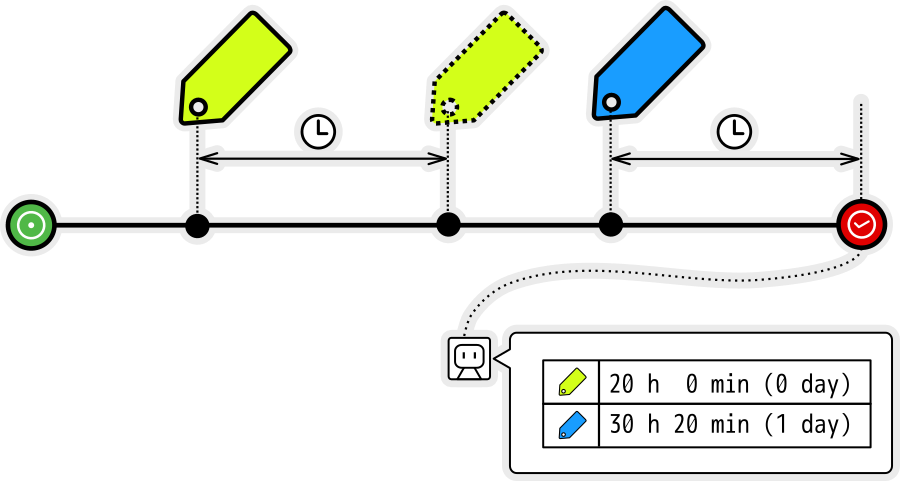

# actions-labeled-duration

Calculate the labeled duration and comment on the GitHub Issue.



## Build

```
npm run build
```

## Usage

```yml
- uses: ./
  with:
    # Tracking labels (Splitted comma)
    labels: label1,label2

    # Tracking project columns (Splitted comma)
    project_columns: TODO,Doing

    # Additional issue comment
    issue_comment: 'The time taken to close this Issue is as follows.'

    # Target issue number(default: current issue number)
    issue_number: 1
```

## Outputs

### `labeled_duration_details`

Details about the time it took to solve the issue (JSON string).

```json
{
  "issue": {
    "number": 1,
    "title": "Issue title",
    "labels": ["label1"],
    "createdAt": "2021-08-26T14:38:16Z",
    "closedAt": "2021-08-29T14:05:46Z"
  },
  "labeledDurations": {
    "label1": {
      "name": "label1",
      "durationMinute": 10,
      "durationDisplayed": "0 h 10 min (0 day)"
    }
  },
  "projectStateDurations": {
    "TODO": {
      "name": "TODO",
      "durationMinute": 210,
      "durationDisplayed": "3 h 30 min (0 day)"
    },
    "Doing": {
      "name": "Doing",
      "durationMinute": 35,
      "durationDisplayed": "0 h 35 min (0 day)"
    }
  }
}
```
